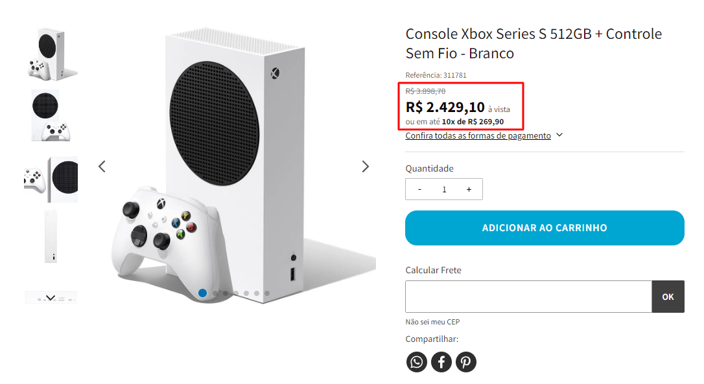
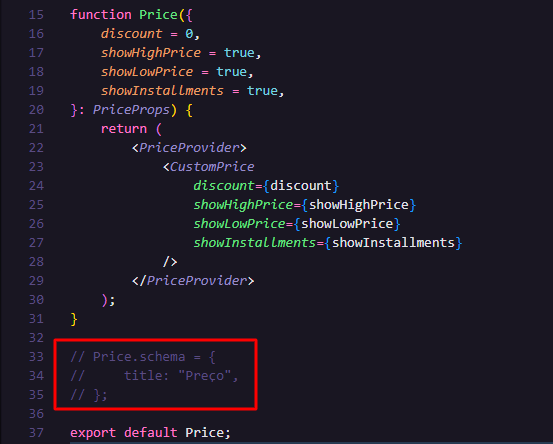
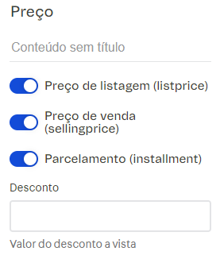

# Price Custom component

Componente que consulta o preço de determinado produto e cria: o valor de venda, o valor de listagem e o parcelamento disponivel. Uma grande vantagem desse componente é nossa liberdade de manipulação do preço, podendo utiliza-lo tanto na pagina de produto quanto nas prateleiras.

Esse componente usa o `vtex.product-context` então é necessario que esteja declarado no `manifest.json` como dependencia. 



Caso queira permitir edição pelo site Editor, basta descomentar esse trecho de código: 



Os campos editáveis aparecerão dessa forma: 



## Implementando o componente no projeto

1. clone o repo para dentro da pasta `react/components`

2. Na raiz da pasta `react` crie um script que irá importa e exportar o componente

```js
import Price from "./components/Price";

export default Price;
```

3. Em `contentSchemas.json` podemos declara-lo da seguinte forma:

```json
    "Price": {
        "title": "Preço",
        "type": "object",
        "properties": {
            "showHighPrice": {
                "title": "Preço de listagem (listprice)",
                "type": "boolean",
                "description": "Valor padrão desta propriedade é 'true'",
                "default": true
            },
            "showLowPrice": {
                "title": "Preço de venda (sellingprice)",
                "type": "boolean",
                "description": "Valor padrão desta propriedade é 'true'",
                "default": true
            },
            "showInstallments": {
                "title": "Parcelamento (installment)",
                "type": "boolean",
                "description": "Valor padrão desta propriedade é 'true'",
                "default": true
            },
            "discount": {
                "title": "Desconto",
                "type": "string",
                "description": "Valor do desconto a vista"
            }
        }
    },
```

4. Em `interfaces.json` basta declara-lo colocando o nome e vendor da loja correspondentes:

```json
    "custom-price": {
        "component": "Price",
        "content": {
            "$ref": "app:{name}.{vendor}#/definitions/Price"
        }
    },
```

5. Podemos usa-lo diretamente nos blocos ou declara-lo com especificações para determinados casos conforme a necessidade. Ex: 

```json
    "custom-price#product": {
        "props": {
            "blockClass": "my-price-class",
            "showHighPrice": false
        }
    },
```


