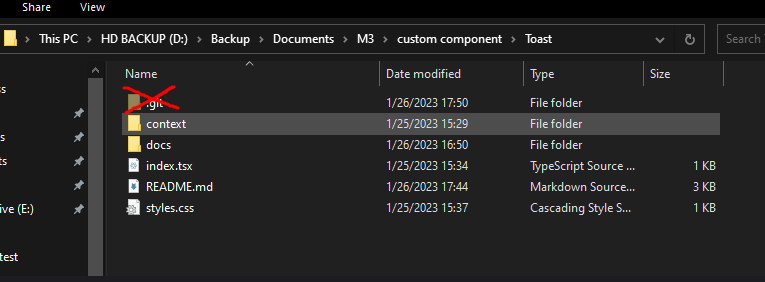

# Introduction 
Serviços em node para vtex.
Esse componente não carrega visualmente, é usado para requisições que possam conter informações sensiveis, logo, é executado no backend.
Pode ser acrescentado no projeto de acordo com o contexto da loja, de duas maneiras diferentes:

- Podemos criar um repositório especifico para esse serviço.

  Caso optem por essa maneira, devemos alterar o repositorio remoto do git usando o comando `git remote` no mesmo diretório da pasta oculta `.git` e passando o endereço do novo repositorio. 
  
  Ex: `git remote set-url origin https://novo.repositorio-remoto.com`. 
  
  Podemos verificar se foi alterado com sucesso com o comando `git remote -v`

- Adicionamos na raiz do projeto.

  Se decidirem inserir diretamente no projeto, devem apenas excluir a pasta oculta `.git`
  

Após inserimos esse componente, devemos ter em mente que é um app independente, então se faz necessário preencher o fomulário da vtex que se encontra [nesse link](https://docs.google.com/forms/d/e/1FAIpQLSfhuhFxvezMhPEoFlN9yFEkUifGQlGP4HmJQgx6GP32WZchBw/viewform) e aguardar aprovação

Lembrando também que devemos trocar o vendor e o name do app para o vendor e name que serão usados na loja atual em **todas as areas indicadas**:
`manifest.json`, `package.json` e `node/package.json` linhas 2 e 3

E também no link em `node/clients/getSellers.ts` linha 24

Importante também lembrarmos de instalar as dependencia executando o comando `yarn` na raiz desse template

Feito essas alterações devemos gerar o `appKey` e o `appToken`, podemos fazer isso seguindo os passos descritos [nesse link](https://blog.vdash.com.br/como-criar-o-appkey-e-apptoken-na-vtex/) e iremos inserir no arquivo `node/keys.ts`.

Nesse template já existe um serviço de exemplo e após essas alterações, caso feitas corretamente, já podemos rodar esse projeto para teste.

Para rodar esse projeto devemos executar no terminal `vtex link` na pasta raiz desse template, após finalizar o link, o endpoint `/_v1/m3-services/sellers` estará disponivel, em caso de sucesso deverá ser retornado a lista de sellers da loja 

_**ATENÇÃO** Caso algo esteja incorreto, ainda retornará o status `200`, porém não retornará dados dos sellers_

Para mais informações sobre serviços em node, acompanhe nossa [documentação no confluence](https://m3ecommerce.atlassian.net/wiki/spaces/DES/pages/61374489/VTEX+-+Services)
