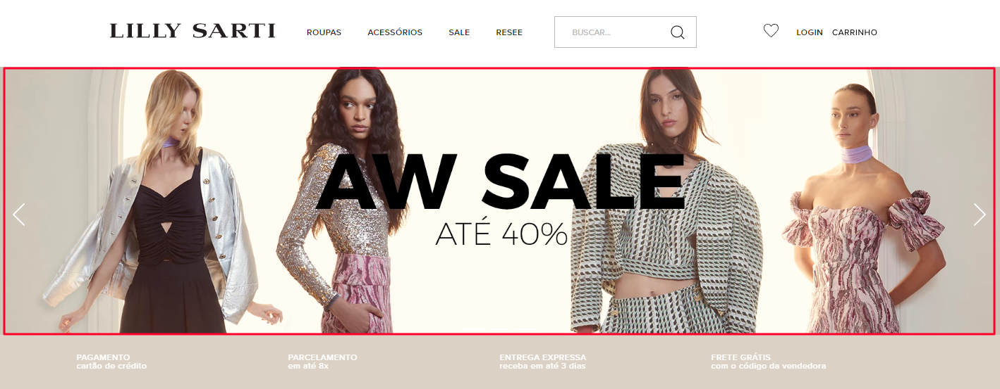

# Image Custom component 
Componente criado como facilitador para trabalharmos com imagens e que nativamente pode ser usado no storefront ou diretamente no React em conjunto com outros componentes.



## Implementando o componente no projeto

1. Clone o repo para dentro da pasta `react/components`

2. Após clonar esse componente no projeto, é necessário apagar a pasta oculta `.git` para que não gere bugs


3. Para utiliza-lo no react basta importar o `M3Img` e passar as propriedas como de uma imagem comum, porém esse componente possui algumas propriedades a mais, porém não obrigatórias: `href` e `responsive`

```js
interface M3ImgProps extends React.ImgHTMLAttributes<HTMLImageElement> {
    /**
     * href indica o link de redirecionamento, 
     * quando passada para o componente a imagem será renderizada
     * com um link de ancora a envolvendo
      */
    href?: string;

    /**
     * responsive é um array de objetos que determina em qual tamanho a imagem especificada deverá ser mostrada. O objeto possui duas propriedades obrigatórias:
     *  - media: É o tamanho especificado para determinada imagem. Ex: (max-width: 1024px)
     *  - srcset: É a imagem que será apresentada em determinado tamanho
      */
    responsive?: Array<{ media: string, srcset: string }>
}

/** 
 * M3PictureProps é a tipagem do componente que atua em conjunto com o M3Img e possui as mesmas propriedades
 */
type M3PictureProps =  M3ImgProps
```

 <p style="background:#fff4bf;color:black;padding:5px 10px;border-radius:5px;width:fit-content;">
    <strong style="color:#ff7f17">ATENÇÃO:</strong> Para utiliza-lo no store, necessitamos seguir com mais algumas configurações.
 </p>

4. Na raiz da pasta `react` devemos acrescentar o arquivo nomeado `M3img` importando e exportando por default o componente:

```js
import M3Img from "./components";

export default M3Img;
```

5. No arquivo `store/interfaces.json` devemos acrescentar:

```json
{
    "M3Img": {
        "component": "M3Img",
        "content": {
            "$ref": "app:{vendor}.{name}#/definitions/M3Img"
        }
    }
}
```

5. Por fim, no arquivo `store/contentSchemas.json` devemos acrescentar:

```json
{
    "M3Img": {
            "title": "Imagem Customizavél",
            "type": "object",
            "properties": {
                "src": {
                    "title": "Imagem",
                    "default": "",
                    "$ref": "app:vtex.native-types#/definitions/url",
                    "widget": {
                        "ui:widget": "image-uploader"
                    }
                },
                "href": {
                    "title": "Link",
                    "type": "string",
                    "default": "/"
                },
                "responsive": {
                    "title": "Tamanhos",
                    "type": "array",
                    "items": {
                        "$ref": "app:{vendor}.{name}#/definitions/M3ImgSizes"
                    }
                }
            }
        },

        "M3ImgSizes": {
            "title": "Imagens responsivas",
            "type": "object",
            "properties": {
                "media": {
                    "title": "Tamanho",
                    "type": "string",
                    "default": "max-width: 1024px"
                },
                "srcset": {
                    "title": "Imagem",
                    "default": "",
                    "$ref": "app:vtex.native-types#/definitions/url",
                    "widget": {
                        "ui:widget": "image-uploader"
                    }
                }
            }
        },
}
```

## Exemplo do modo de uso no React

```js
import M3Img from "./M3Img";

function MySampleComponent() {

    const imgMobile = [
        // Esse objeto indica que a imagem 'sample-tablet.png' será mostrada 
        // em telas de até 1024px
        { media: "max-width: 1024px", srcset: "assets/img/sample-tablet.png" },

        // Esse objeto faz o mesmo com a imagem 'sample-mobile.png', 
         // porém determinando o tamanho maximo de telas para 640px 
        { media: "max-width: 640px", srcset: "assets/img/sample-mobile.png" },
    ]

    return (
        <MySample>
            <M3Img
                href="https://algum-lugar.com.br"
                className={style["imagemEstilosa"]}
                src="assets/img/sample-img.png"
                alt="Imagem de exemplo"
                responsive={imgMobile}
            />
            ...
        </MySample>
    );
}

```

## Exemplo do modo de uso no store

```json
{
    "M3Img#sample": {
        "props": {
            "href": "https://algum-lugar.com.br",
            "src": "assets/img/sample-img.png",
            "alt": "Imagem de exemplo",
            "responsive": [
                { 
                    "media": "max-width: 1024px", 
                    "srcset": "assets/img/sample-tablet.png" 
                },
                {
                    " media": "max-width: 640px", 
                    "srcset": "assets/img/sample-mobile.png" 
                }
            ]
        }
    }
}
```

## Exemplo do componente no site editor

